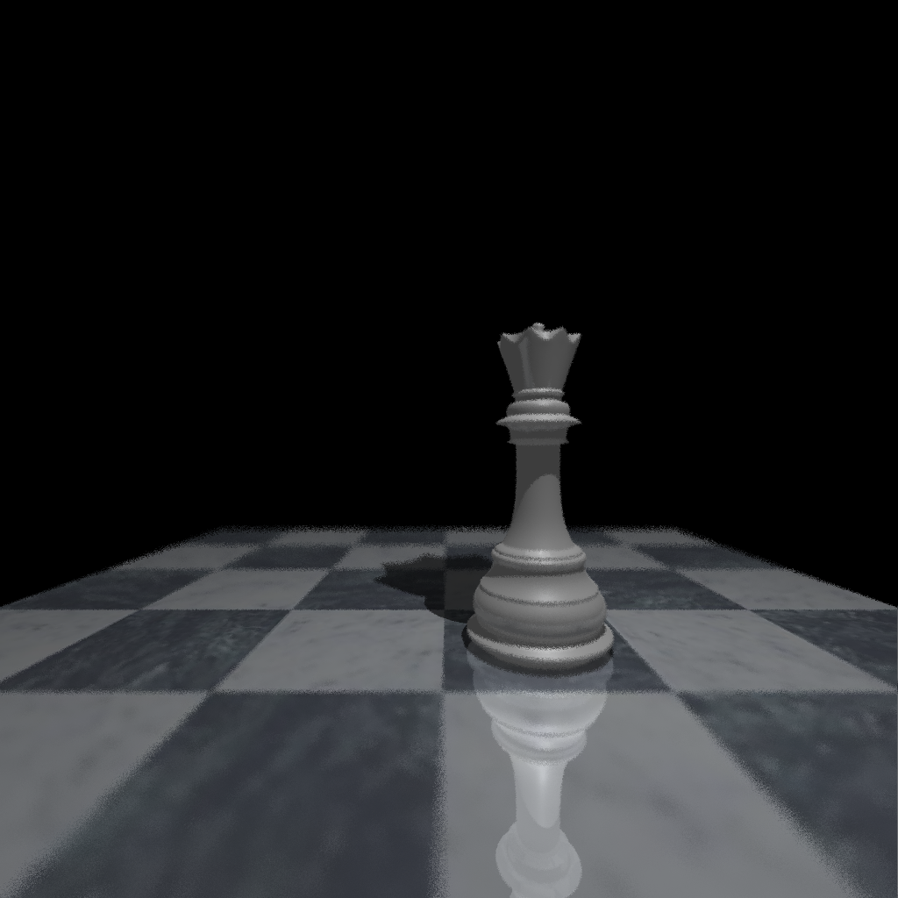

# Raytracer

A (whitted) Raytracer written in Rust. It can read in scenes from xml files and produce images or small animations as output (see [Examples](#examples)).
This was originally written for the [GFX 25S course of University of Vienna](https://ufind.univie.ac.at/en/course.html?lv=052200&semester=2025S).
To use the Raytracer, clone the repo, create a scene in the [specified xml-schema](#xml-schema) (or use one of the example files in the `scenes` directory) and [run](#running-the-raytracer) the program using cargo.

## Capabilities

The Raytracer uses a [Whitted](https://www.scratchapixel.com/lessons/3d-basic-rendering/ray-tracing-overview/light-transport-ray-tracing-whitted.html) ray tracing algorithm.
It can send out reflected-, refracted-, and shadowrays and calculates color based on some shading model (in this case phong or cook torrance). This algorithm is good at highly reflective surfaces, but not diffuse surfaces.

The Raytracer can handle spheres, more complex objects (defined by [.obj](https://en.wikipedia.org/wiki/Wavefront_.obj_file) files) and 4-dimensional julia sets (as described by [this](https://www.cs.cmu.edu/~kmcrane/Projects/QuaternionJulia/paper.pdf) paper). Each object can be either shaded (using either [phong](https://en.wikipedia.org/wiki/Phong_reflection_model) or [cook torrance](https://graphicscompendium.com/references/cook-torrance) shading models) or (with exception of julia sets) textured.
For each object there can also be an arbitrary amount of transformations (translation, rotation, scaling) that are applied to the oject as they appear in the xml file.

It is also possible to use the Raytracer to create small animations. For this you will have to define additional end parameters in the xml file (for more information see [the file format](#extensions)).
Animations will always be exported as APNG files, even if `--ppm` was toggled.

For better performance, the Raytracer uses multiple threads for rendering (using the [rayon](https://github.com/rayon-rs/rayon) crate). Some scenes with complex geometry can still take quite a while to render.

## XML-Schema

For the base functionality the Raytracer adheres to the scheme specified [here](https://teaching.vda.univie.ac.at/graphics/25s/Labs/Lab3/lab2_file_specification.html).
Additionally there are some (optional) extensions that can also be specified inside the xml files:

### Extensions

- Depth of Field
  - can be specified in the xml files as a subfield of the camera. It takes the focal length and the aperture size as parameters
  - `<depth_of_field focal_length=".." aperture=".." />`
  - Best if used with supersampling

- Cook-Torrance model
  - can be specified in the xml files insted of the `phong` field in the material. It takes ambient and specular coefficients, as well as the material roughness
  - `<cook_torrance ka=".." ks=".." roughness=".." />`

- Animations
  - can be specified in the xml files by adding the `animated` field to the scene, which specifies the number of frames as well as the framerate
  - `<animated frames=".." fps=".." />`
  - for the objects to actually change between frames, you can specify endparameters for the objects. The program will linearly interpolate between start and end parameter for each frame
  - This is supported for spheres, where endposition and endradius can be specified, and julia sets where the endconstant can be specified
  - `<endposition x=".." y=".." z=".." />`

- Motion Blur
  - can not be completely specified in the xml files, but requires the `--blur` commandline flag
  - this requires the scene to be already animated (so some objects are moving)
  - this effect does not have a custom xml file. Use one for the animations and add the `--blur` flag

- Julia sets
  - Can be specified in the xml files similar to spheres and meshes. They take maximum iterations, epsilon, a position, and a constant (and an endconstant if animated)
  - They support only solid materials (how would you even texture map this?)

```xml
<julia_set max_iterations=".." epsilon="..">
    <position x=".." y=".." z=".." />
    <constant x=".." y=".." z=".." w=".." />
    <!-- material and transforms -->
</julia_set>
```

- Supersampling
  - Can be specified in the xml files as a field for the scene. It takes the number of samples
  - this has no dedicated custom xml file, but is instead used in some of the other effects (i.e. depth_of_field)
  - `<super_sampling samples=".." />`

## Running the Raytracer

The input file can be given via a commandline argument. So the program can be compiled and run with the following command:

```sh
cargo build --release
./target/release/ray-tracer scenes/example1.xml
```

For convenience I have included a Makefile that will compile the program (`all` will use release build and `debug` will use debug build) and run it with all the provided input files (excluding `chess.xml`)

### Commandline Options

- The program exports all images as with the PNG image format by default. To export as a PPM file instead, use the `--ppm` flag

- For animations, the `--blur` flag can be used to render a singular animations with the moving objects having motionblur. If the scene has no moving objects or is just a singular image, this will have no effect.. If the scene has no moving objects or is just a singular image, this will have no effect.

- The program will save the resulting image files with the name specified in the input file in an `output` directory
  - The output directory can be changed using the `-o` (`--outdir`) flag
  - If the specified directory does not exist, the program will fail

- Especially a for a long running file it is nice to have some feedback that the program is doing something. For this you can run the program with the `-p`/`--progress-bar` flag to show a progress bar that shows how far along the program is

- For all commandline options run the program with the `-h`/`--help` flag

## Examples



